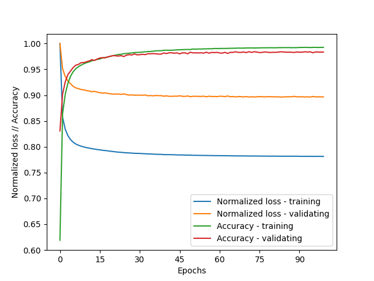

# Machine Vision

## Number recognition [OpenCV,Torch Python]
The goal of the project was to create and deploy convolutional neural network that would be able to identify hand-written numbers. It was achieved using PyTorch (Machine learning elements) and OpenCV (Image processing).

### Neural network:
- network structure: leNet-5
- learning_rate: 1e-4
- batch_size: 50
- n_epochs: 100
- loss function: CrossEntropyLoss()
- optimizer: Adam algorithm
- training dataset: 60000 edited images from NMIST dataset
- validation dataset: 10000 edited images from NMIST dataset
- trained using Google Collab

Training accuracy: *0.9927*

Validation accuracy: *0.9835*

### Programme framework plan:
1. Loading frame from webcam
2. Pre-processing
    - cropping frame
    - tresholding (Otsu method) and inverting
    - detecting biggest contour in frame
    - creating bounding box around said contour and then cropping it
    - resizing image to 28x28
    - changing format to 8-bit
4. Preparing data
    - converting to PIL image
    - transforming to PyTorch tensor
    - loading with data loader utility
6. Sending data to neural network

### Program in action:

*TO DO - add clip*

## Reading time on analogue clock [OpenCV C++]
The goal of the project was to create a programme that would be able to tell the time based on a picture of a analogue clock.

### Programme framework plan:

1. Loading image
2. Pre-processing
    - contrast correction
    - gaussian blur
    - detecting the clock face (*HoughCircles*)
    - cropping the region of interest
4. Segmentation
    - treshholding
    - dilatation
    - erosion
    - bit inversion
    - end effect - monochromatic image of clock face
6. Analysis
    - detecting contours
    - removing small or non-rectangular contours
    - identyfing the hands of the clock
    - measuring the absolute angle between hands of the clock and Y axis
    - calculating the time based on the angle data
8. Saving output image

### Effects of the program:
Input:

Output

